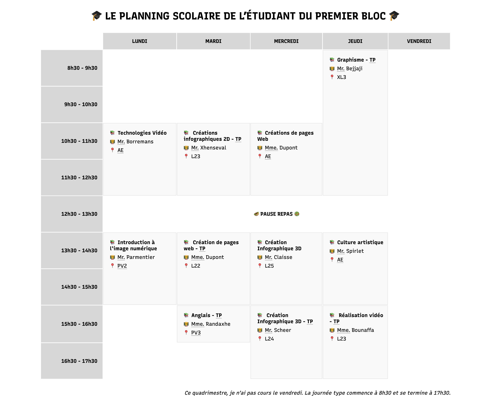
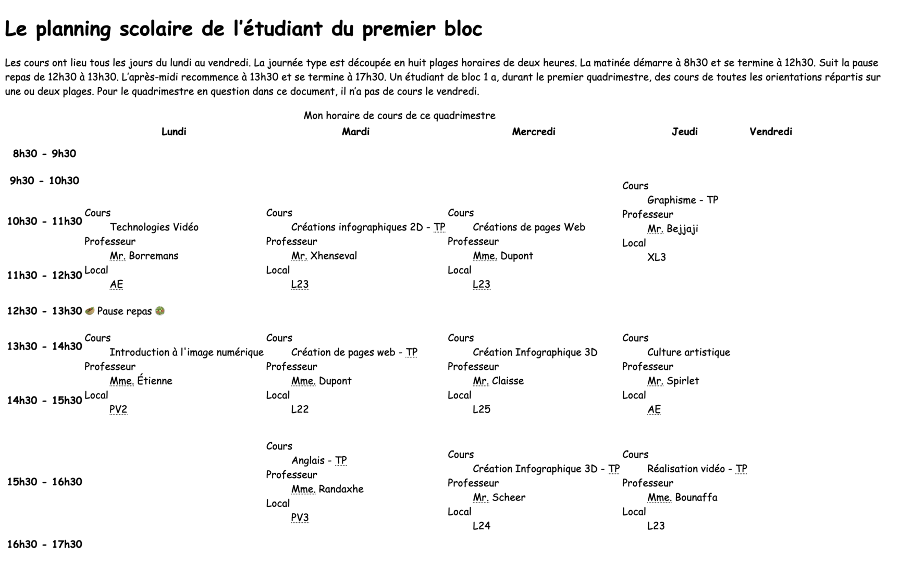

# html-table-schedule

> HTML exercise about tables

* * *

**html-table-schedule** is an educational project, which will be used for HTML courses.

**Note:** the school where the course is given, the [HEPL](http://www.provincedeliege.be/hauteecole) from Liège, Belgium, is a french-speaking school. From this point, the instruction will be in french. Sorry.

* * *

## Exercice sur les tableaux

Réalisez le planning type d’étudiant de B1 en infographie pour un quadrimestre particulier.

Lisez attentivement les commentaires écrits en haut du fichier CSS, ils seront des aides précieuses pour un balisage compatible avec les styles définis et vous donneront quelques indices sur les balises à utiliser 😉.

Voici le résultat attendu avec la feuille de styles fournie :

Et sans la feuille de styles :

## Contenus
Les émojis sont ajoutés par le CSS, vous ne devez pas les ajouter dans votre HTML.

- mots-clés : html, table, planning, horaire, infographie
- description : Le planning scolaire de l’étudiant de B1 en techniques graphiques
- title : Planning scolaire en B1 infographie
- titre principal : Le planning scolaire de l’étudiant du premier bloc
- légende du tableau : Ce quadrimestre, je n'ai pas cours le vendredi. La journée type commence à 8h30 et se termine à 17h30.
- Jours de la semaine : Lundi, Mardi, Mercredi, Jeudi, Vendredi (en-tête de colonne)
- Plages horaires : 8h30-09h30, 09h30-10h30, 10h30-11h30, 11h30-12h30, 13h30-14h30, 14h30-15h30, 15h30-16h30, 16h30-17h30 (en-tête de ligne)
- Horaire : 10h30-12h30 ; Cours : Technologies Vidéo ; Professeur : Mr. Borremans ; Local : AE (Auditorium Thomas Edison)
- Horaire : 13h30-15h30 ; Cours : Introduction à l'image numérique ; Professeur : Mr. Parmentier ; Local : PV2 (Pavillon 2)
- Horaire : 10h30-12h30 ; Cours : Créations infographiques 2D - TP ; Professeur : Mr. Xhenseval ; Local : L23
- Horaire : 13h30-15h30 ; Cours : Créations de pages web - TP ; Professeur : Mme. Dupont ; Local : L22
- Horaire : 15h30-16h30 ; Cours : Anglais - TP ; Professeur : Mme. Randaxhe ; Local : PV3 (Pavillon 3)
- Horaire : 10h30-12h30 ; Cours : Créations de pages web ; Professeur : Mme. Dupont ; Local : AE (Auditorium Thomas Edison)
- Horaire : 13h30-15h30 ; Cours : Créations infographiques 3D ; Professeur : Mr. Claisse ; Local : L25
- Horaire : 15h30-17h30 ; Cours : Créations infographiques 3D - TP ; Professeur : Mr. Scheer ; Local : L24
- Horaire : 8h30-12h30 ; Cours : Graphisme - TP ; Professeur : Mr. Bejjaji ; Local : XL3
- Horaire : 13h30-15h30 ; Cours : Culture artistique ; Professeur : Mr. Spirlet ; Local : AE (Auditorium Thomas Edison)
- Horaire : 15h30-17h30 ; Cours : Réalisation vidéo - TP ; Professeur : Mme. Bounaffa ; Local : L23
